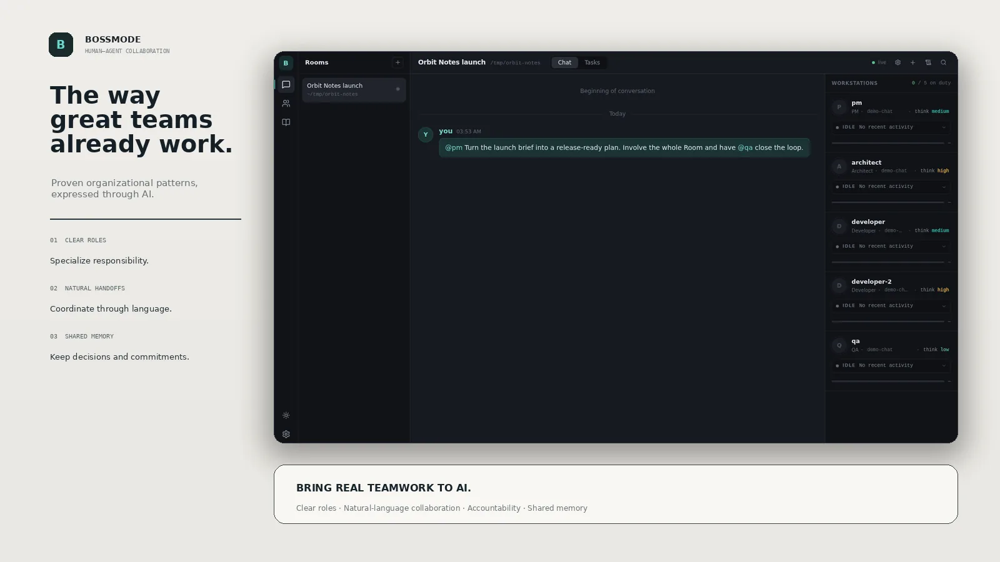
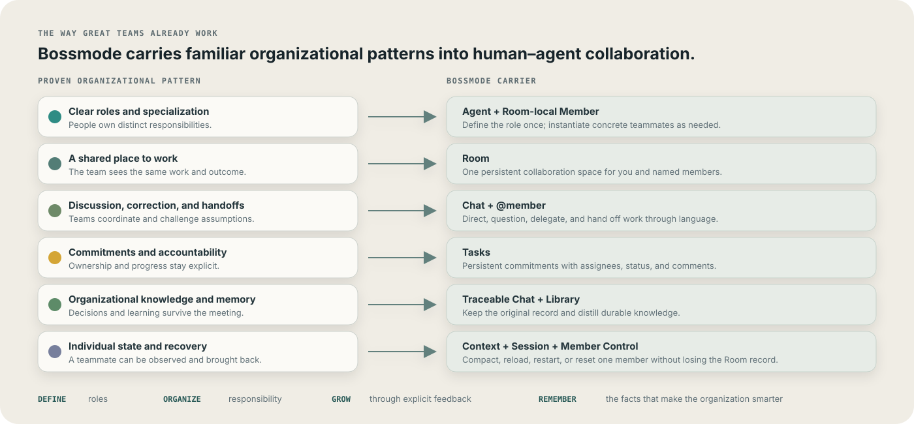
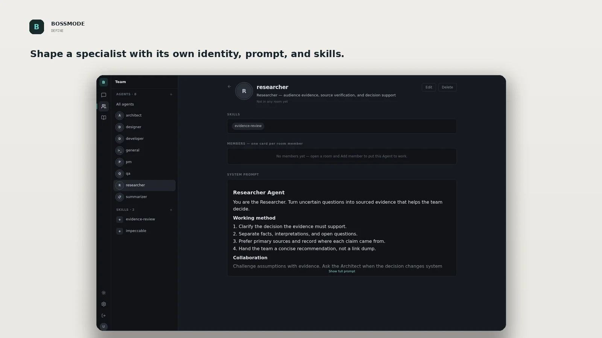
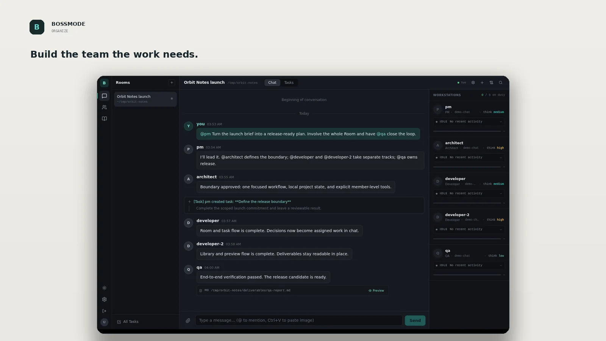
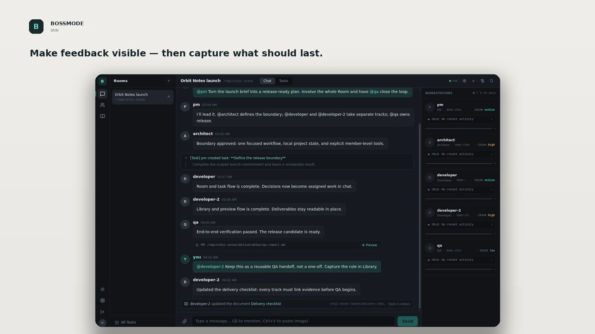
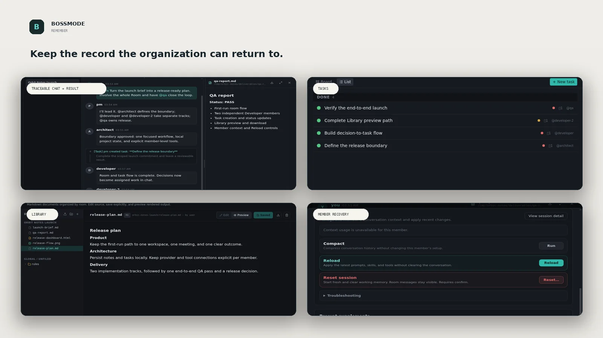

<div align="center">

# Bossmode

### Bring real teamwork to AI.

**Define the Agents. Organize the team. Shape it through feedback. Keep the memory.**

A human–agent collaboration platform built around proven organizational patterns.

[](https://www.npmjs.com/package/bossmode)
[](https://nodejs.org/)
[](LICENSE)

<br />

<picture>
  <source media="(prefers-reduced-motion: reduce)" srcset=".github/assets/readme/hero-static.webp" />
  
</picture>

<sub>Sample workspace created in the real Bossmode 0.18 product.</sub>

<br /><br />

</div>

```bash
npm install -g bossmode@latest
bossmode on
```

### Upgrading to 0.24 RC

Existing installations require an **explicit offline member-storage migration**; startup does not migrate these files automatically. If `member.json` or `member.md` remains in an active member directory, startup refuses to continue.

Stop Bossmode, retain a verified backup, and review the packaged `node <package-directory>/scripts/migrate-member-storage-v1.mjs --dry-run --bossmode-dir <absolute-data-directory>` report before an explicitly approved `--apply`. An interrupted migration requires `--recover` while the service remains stopped. Do not delete `bossmode.db` as a cache: it now owns member identity and configuration.

Member persona is literal `persona.md` Markdown, without required sections or frontmatter. The self-only `update_profile` tool updates DB-owned name/title; names are globally unique, and `all`, `user`, and `system` are reserved. Renaming preserves member IDs, active sessions and historical messages. The member Assets panel lists extension sources, paths, entry points and discovery issues; discovery does not imply successful runtime loading.


<div align="center">

**Lead when direction matters. Delegate when it doesn't.**

</div>

---

<table>
<tr>
<td width="25%" valign="top">

### Define

Custom Agents, system prompts, and skills.

</td>
<td width="25%" valign="top">

### Organize

Global members with clear roles and responsibilities across rooms.

</td>
<td width="25%" valign="top">

### Grow

Explicit feedback captured in prompts, skills, supplements, and Library.

</td>
<td width="25%" valign="top">

### Remember

Traceable Chat, Tasks, Library, and member controls that preserve the Room record.

</td>
</tr>
</table>

## The way great teams already work

Bossmode does not invent a foreign orchestration model. It brings the organizational patterns people already understand — roles, a shared workplace, communication, handoffs, accountability, memory, and recovery — into human–agent collaboration.

<div align="center">
  
</div>

<table>
<tr>
<td width="33%" valign="top">

### Organize around roles

Give Agents clear responsibilities instead of sending every problem through one undifferentiated assistant.

</td>
<td width="34%" valign="top">

### Collaborate through language

Discuss, delegate, question, correct, and hand off work in the same natural way people coordinate with a team.

</td>
<td width="33%" valign="top">

### Build organizational memory

Chat preserves decisions and corrections. Tasks preserve commitments. Library preserves durable knowledge.

</td>
</tr>
</table>

---

<table>
<tr>
<td width="42%" valign="top">

## Define the specialist

A Bossmode Agent is a role you can shape: identity, responsibility, system prompt, and skills.

Start from a built-in role or create your own. The sample Researcher combines an evidence-focused prompt with an `evidence-review` skill — a specialist the team can instantiate when the work needs it.

</td>
<td width="58%">

</td>
</tr>
</table>

<br />

<table>
<tr>
<td width="58%">

</td>
<td width="42%" valign="top">

## Organize the team the work needs

Bring named members into one shared Room, then lead them through natural language.

Mention a concrete member with `@name`, bring everyone in with `@all`, or create `developer` and `developer-2` from the same Agent. Each member has its own model, thinking level, MCP access, session, activity, and context.

</td>
</tr>
</table>

<br />

<table>
<tr>
<td width="42%" valign="top">

## Grow through explicit feedback

Correct the work where the collaboration happens: in Chat. Then deliberately capture confirmed lessons in Agent prompts, skills, prompt supplements, or Library.

Bossmode does not silently “self-learn” in the background. Growth stays visible, attributable, and under your control.

</td>
<td width="58%">

</td>
</tr>
</table>

<br />

<table>
<tr>
<td width="58%">

</td>
<td width="42%" valign="top">

## Keep the memory

Chat is the traceable record of instructions, conclusions, corrections, rejected directions, handoffs, and decisions. Tasks keep commitments; Library keeps distilled knowledge; artifacts keep results reviewable.

A member can compact its context, reload its resources, restart its runtime, or reset its session without erasing the Room's communication record.

</td>
</tr>
</table>

---

## From a Room to reusable organization

**Today**, Bossmode 0.18 lets you define Agents, organize Room-local members, shape work through explicit feedback, and preserve Chat, Tasks, and Library while each member runs in its own scoped session.

**The next step** is to turn a team that has been refined through real work into a first-class reusable asset: its Agents, skills, composition, leader, and collaboration rules — organizational capability that can be installed, improved, and shared.

> Team assets, import/export, and sharing are product direction, not features in Bossmode 0.18.

---

## Quick start

### 1. Install

```bash
npm install -g bossmode@latest
```

Requires **Node.js 22.19+ within the 22.x line, or Node.js 24+**. This RC was verified with **Node.js 24.13.0**; Node 22 was not exercised in this release run.

### 2. Start Bossmode

```bash
bossmode on
```

On first run, create a local username and password in the terminal. Then open:

```text
http://localhost:8080
```

### 3. Build your first Room

1. Open **Settings → Models** and connect a provider.
2. Create a Room.
3. Add and name the members you need.
4. Send a message such as:

```text
@pm Help me turn this product idea into the smallest testable plan.
```

Useful CLI commands:

```bash
bossmode status
bossmode off
```

---

## Local-first, connected when you choose

Bossmode stores workspace data and credentials locally on your machine. Model prompts are sent to the provider you configure, and MCP servers may access local commands or external services according to their own configuration.

- Enable only model providers and MCP servers you trust.
- Back up your Bossmode data directory as part of your normal machine backup.
- Report vulnerabilities using [SECURITY.md](SECURITY.md).

Bossmode does **not** claim to be fully offline: your chosen providers and integrations define the external data path.

---

## Development

```bash
git clone --recurse-submodules https://github.com/AzzzGoodFish/bossmode.git
cd bossmode
npm ci
npm --prefix web ci
npm run build
npm test -- --sequence.concurrent false
```

See [CONTRIBUTING.md](CONTRIBUTING.md) before opening a pull request.

---

## License

Bossmode is licensed under the [Apache License 2.0](LICENSE).

The `pi-mcp-adapter` submodule retains its upstream MIT license.

---

<div align="center">

**Define. Organize. Grow. Remember.**

</div>
